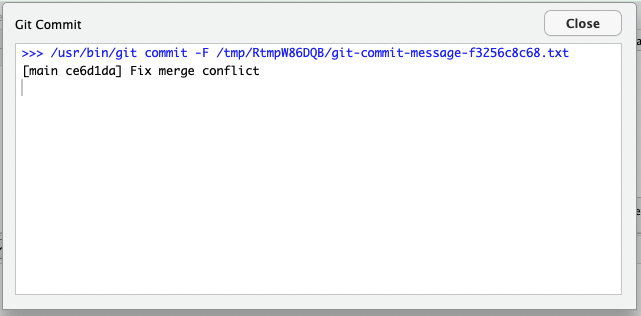

# git-help

A list of issues encountered when working with git.

# Can’t push to GitHub!

## Error

> **Error message:** Failed to push some refs to

## Translation

| type     | text                                                                                         | translate                                                                                                                                     |
|----------|----------------------------------------------------------------------------------------------|-----------------------------------------------------------------------------------------------------------------------------------------------|
| error    | failed to push some refs to ‘<https://github.com/>…’                                         | I could not push the changes to GitHub that you have committed.                                                                               |
| hint     | Updates were rejected because the remote contains work that you do not have locally.         | There is work in the repo on GitHub (the remote) that you do not have in the location that you work with R (e.g. your laptop, RStudio Cloud). |
| hint     | This is usually caused by another repository pushing to the same ref.                        | Someone else (including you on another computer) is working on this repo and has pushed some changes to it.                                   |
| solution | You may first want to integate the remote changes (e.g. ’ git pull …’) before pushing again. | Pull, then push again.                                                                                                                        |

## Solution

**Pull.** If the work that you pull from GitHub does not overlap with
something you have worked on locally (on your computer or RStudio
Cloud), then this will be the solution. If you have had changes locally
that overlap with the pulled changes on GitHub, you will receive another
error message (to be written up).

In this case, the file `ae-10a-lifecycle-solutions.qmd` was added to the
repo by an instructor.

**Push**. And keep on working with the next commit.

# Can’t pull from GitHub!

## Error

> **Error message:** Your local changes to the following files would be
> overwritten by merge:

## Translation

| type     | text                                                                                           | translation                                                                                                                                                                             |
|----------|------------------------------------------------------------------------------------------------|-----------------------------------------------------------------------------------------------------------------------------------------------------------------------------------------|
| error    | Your local changes to the following files would be overwritten by merge: `01-introduction.qmd` | You have worked on the `01-introduction.qmd` file, but someone else has also done so and pushed their changes to GitHub. I can’t pull them because your code/text would be overwritten. |
| solution | Please commit your changes or stash them before your merge.                                    | Before you get the changes from GitHub and add them to your file, go through the “Add -\> Commit -\> Push” workflow.                                                                    |

## Solution

**Add -\> Commit -\> Push.** Add your changes to the file(s) to the
staging area, commit your changes with a meaningful commit message, and
push your changes back to GitHub.

## Error

> **Error message:** Failed to push some refs to

## Translation

| type     | text                                                                                                | translation                                                                                                                                                              |
|----------|-----------------------------------------------------------------------------------------------------|--------------------------------------------------------------------------------------------------------------------------------------------------------------------------|
| error    | failed to push some refs to ‘<https://github.com/>…’                                                | I could not push the changes to GitHub that you have committed.                                                                                                          |
| hint     | Updates were rejected because the the tip of your current branch is behind it’s remote counterpart. | As you have already learned when you tried to pull, there changes on GitHub that you do not have in the location that you work with R (e.g. your laptop, RStudio Cloud). |
| solution | Integate the remote changes (e.g. ’ git pull …’) before pushing again.                              | I am telling you to pull again to get the work from GitHub, even though that didn’t work in first place.                                                                 |

## Solution

**Pull.** Trust me on this one and pull.

## Message

> **Message:** CONFLICT (content): Merge conflict in

## Translation

| type     | text                                                        | translation                                                                                                                                                                                                      |
|----------|-------------------------------------------------------------|------------------------------------------------------------------------------------------------------------------------------------------------------------------------------------------------------------------|
| message  | CONFLICT (content): Merge conflict in `01-introduction.qmd` | I have tried bring your changes to the `01-introduction.qmd` file in harmony with the content that I pulled from GitHub.                                                                                         |
| hint     | Automatic merge failed;                                     | What I tried didn’t work, because you made changes to the text/code at the same places.                                                                                                                          |
| solution | fix conflicts and then commit the result                    | Open the `01-introduction.qmd` again. I have added some references to the places where the conflicts exist. Fix those by deciding which content to keep, then go through the “Add -\> Commit -\> Push” workflow. |

## Solution

### Step 1

First, take a peak at your the Git pane in the top right window of
RStudio IDE.

The “Status” of the `01-introduction.qmd` file has changes from `M`
(modified) to `U U` (umerged). The tick box under “Staged” has also
changed from an arrow to a blue square. Nothing to do here for now.

### Step 2

Next, take a peak at the Diff (differences) of the `01-introduction.qmd`
. You will see content that was deleted or moved (in red) and content
that was added in green. You may also already notice some unfamiliar
looking text:

> \<\<\<\<\<\<\< HEAD
>
> *Everything that’s located here is the content that you have written
> locally.*
>
> =======
>
> *Everything that’s located here is the content that someone else has
> written, pushed to GitHub, and that you have just pulled.*
>
> \>\>\>\>\>\>\> b6ad8157c69131b1a582affe962d7ab0bb28cfb3

### Step 3

Open the \`01-introduction.qmd\` file in your code editor. Decide which
text/code to keep and what to delete. Most importantly, remove the three
unfamiliar looking lines.

### Step 4

**Add -\> Commit -\> Push.** Open the Git pane in the top right window
of RStudio IDE. You will see the status has changed back to `M`
(modified). You can now follow the “Add -\> Commit -\> Push” workflow. A
meaningful commit message would be “Fix merge conflict” as that is what
you have just done by deciding which content to keep in the file.

-   Add

-   Commit with commit message “Fix merge conflict”

-   Push

